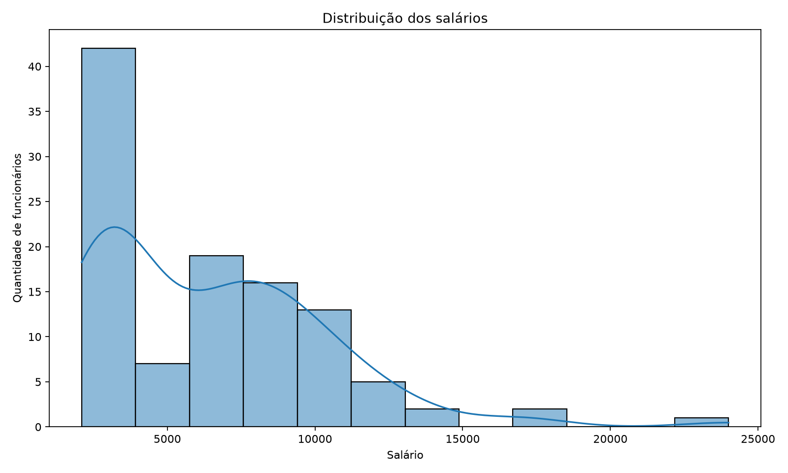
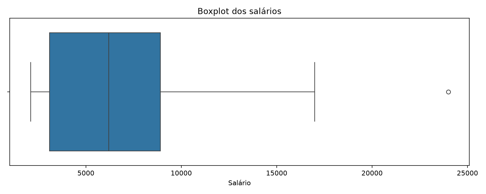
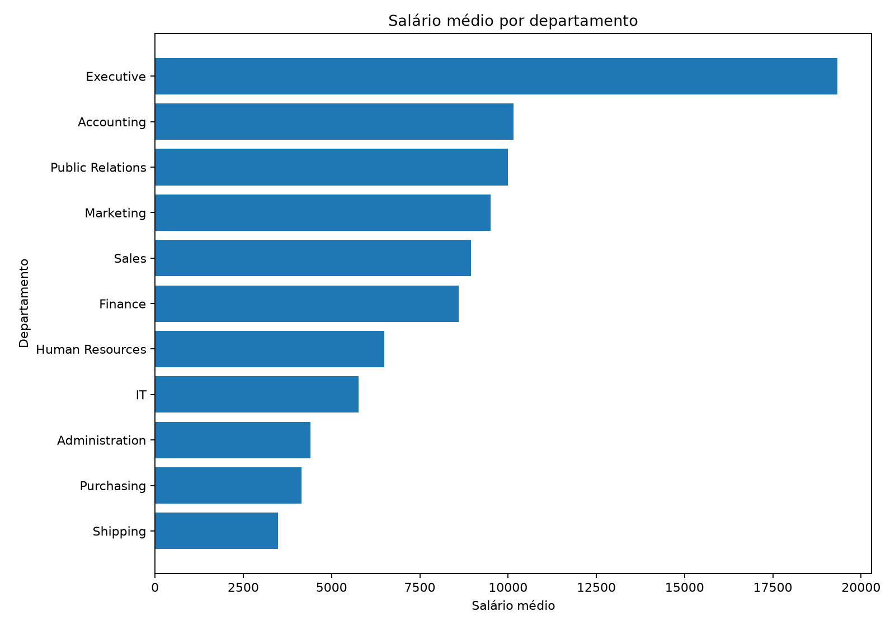
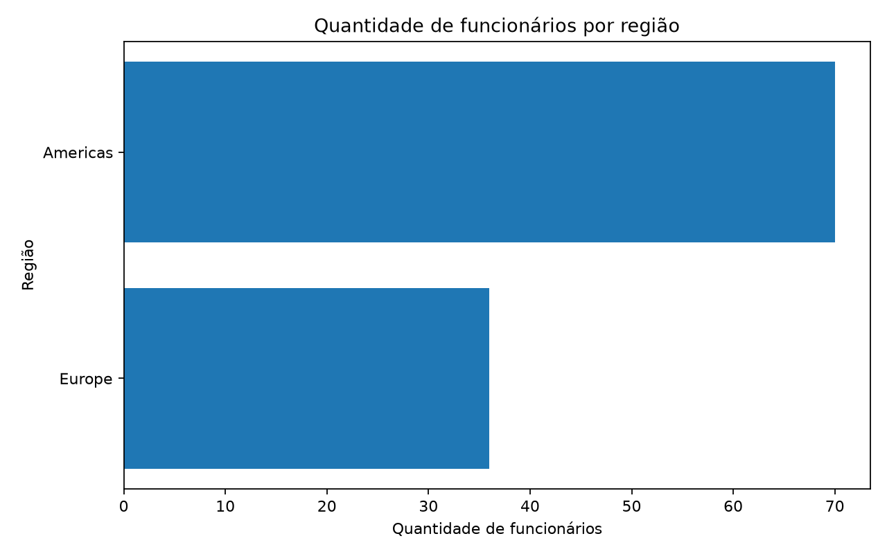
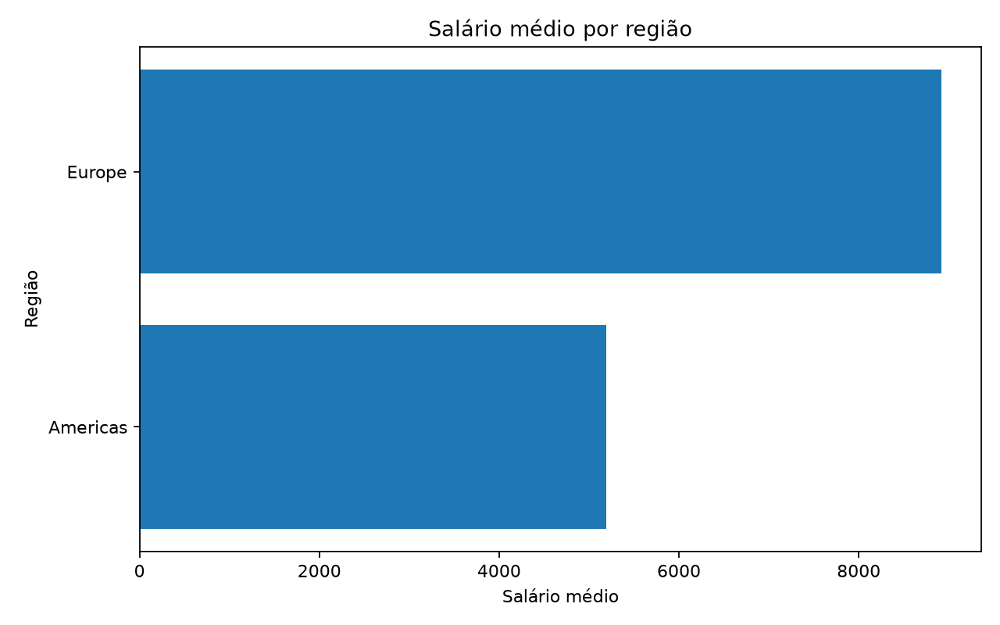

# Análise de Recursos Humanos com SQL e Python

Projeto avaliativo do Módulo 1 da formação **Visualização de Dados e Business Intelligence**, utilizando SQL, Python e técnicas de análise exploratória e visualização de dados.

## Identificação

**Aluno:** Charles Ricardo Nascimento D' Lima  
**Turma:** T3

## Apresentação em vídeo

[Assistir à apresentação do projeto](https://youtu.be/2PRN0uXB2xE)

## Objetivo

Analisar dados de Recursos Humanos a partir do schema HR, investigando:

- salários por departamento e cargo;
- distribuição de funcionários por região;
- diferenças salariais entre grupos;
- qualidade dos dados, incluindo valores ausentes e duplicidades.

## Tecnologias

- SQL
- FreeSQL
- Python
- Pandas
- NumPy
- Matplotlib
- Seaborn
- Git
- GitHub

## Estrutura do projeto

| Pasta/arquivo | Descrição |
| --- | --- |
| `sql/` | Consultas SQL utilizadas na extração |
| `data/` | CSVs exportados do FreeSQL |
| `src/main.py` | Análise exploratória, estatísticas e geração dos gráficos |
| `images/` | Gráficos gerados pela execução do Python |
| `requirements.txt` | Dependências Python do projeto |

## Tabelas utilizadas

- `EMPLOYEES`: dados dos funcionários, incluindo identificação, cargo, salário e departamento.
- `DEPARTMENTS`: informações dos departamentos e suas localizações.
- `JOBS`: informações dos cargos, incluindo o nome da função.
- `LOCATIONS`: dados de endereço, cidade e estado ou província.
- `COUNTRIES`: países associados às localizações.
- `REGIONS`: regiões geográficas associadas aos países.

## Consultas SQL

### Query 1 — Salários por departamento e cargo

Relaciona `EMPLOYEES`, `DEPARTMENTS` e `JOBS` por meio de `LEFT JOIN`.

O filtro utilizado foi:

```sql
WHERE funcionarios.SALARY > 0
```

A base possuía 107 funcionários e os 107 atenderam ao filtro, portanto nenhum registro foi removido da análise salarial.

Arquivo: `sql/query_1.sql`  
Resultado: `data/query_01.csv`

### Query 2 — Funcionários por região

Relaciona `EMPLOYEES`, `DEPARTMENTS`, `LOCATIONS`, `COUNTRIES` e `REGIONS`.

O filtro utilizado foi:

```sql
WHERE regioes.REGION_NAME IS NOT NULL
```

Antes do filtro havia 107 registros. Após manter apenas funcionários com região identificada, permaneceram 106 registros.

Arquivo: `sql/query_2.sql`  
Resultado: `data/query_02.csv`

## Análise exploratória

A análise em Python verifica:

- quantidade de linhas e colunas;
- tipos de dados;
- valores ausentes;
- registros duplicados;
- estatísticas descritivas;
- média, mediana, mínimo e máximo salarial;
- agrupamentos por departamento, cargo e região.

### Qualidade dos dados

- Query 1: 107 registros e nenhum registro duplicado.
- Query 2: 106 registros e nenhum registro duplicado.
- Query 1 possui 1 funcionário sem departamento informado.
- Query 2 possui 1 registro sem estado/província informado.

## Principais resultados

| Indicador | Resultado |
| --- | ---: |
| Salário médio | 6.461,83 |
| Salário mediano | 6.200,00 |
| Menor salário | 2.100,00 |
| Maior salário | 24.000,00 |
| Funcionários nas Américas | 70 |
| Funcionários na Europa | 36 |
| Média salarial nas Américas | 5.191,66 |
| Média salarial na Europa | 8.916,67 |

### Departamentos

O departamento **Shipping** concentra 45 funcionários e possui salário médio aproximado de **3.475,56**.

O departamento **Sales** possui 34 funcionários e salário médio aproximado de **8.955,88**.

O departamento **Executive** apresenta a maior média salarial, aproximadamente **19.333,33**, porém possui apenas 3 funcionários. Por isso, essa média deve ser interpretada considerando o tamanho reduzido do grupo.

### Regiões

A base regional contém 70 funcionários nas **Américas** e 36 na **Europa**.

A Europa apresenta salário médio aproximado de **8.916,67**, superior ao das Américas, de aproximadamente **5.191,66**. Essa diferença deve ser interpretada em conjunto com a composição dos departamentos e cargos presentes em cada região.

## Visualizações

### Distribuição salarial



### Boxplot dos salários



### Salário médio por departamento



### Funcionários por região



### Salário médio por região



## Pré-requisitos

- Python 3 instalado;
- `pip` disponível;
- Git para clonagem e versionamento do projeto.

## Como executar

### 1. Criar ambiente virtual

```bash
python -m venv .venv
```

No Windows PowerShell:

```powershell
.\.venv\Scripts\Activate.ps1
```

### 2. Instalar dependências

```bash
pip install -r requirements.txt
```

### 3. Executar a análise

```bash
python src/main.py
```

O programa exibirá os resultados da análise no terminal e salvará os gráficos na pasta `images/`.

## Principais insights

A análise mostra forte diferença salarial entre departamentos e regiões. Os departamentos com maior número de funcionários não são necessariamente os que apresentam maiores médias salariais.

Também foi observada diferença entre média e mediana salarial, indicando influência de salários elevados na distribuição, especialmente em cargos de liderança.

## Limitações

A análise representa apenas os dados disponíveis no schema HR utilizado na atividade. Grupos com poucos funcionários podem apresentar médias pouco representativas e não devem ser avaliados isoladamente em uma decisão real de Recursos Humanos.

Além disso, a comparação regional pode refletir diferenças na composição de cargos e departamentos e não necessariamente um efeito exclusivo da localização.

## Melhorias futuras

Como evolução do projeto, seria possível:

- ampliar a análise para tempo de empresa e histórico de cargos;
- analisar diferenças salariais considerando senioridade e tempo de contratação;
- criar um dashboard interativo;
- aprofundar o tratamento de valores ausentes;
- adicionar novas métricas e comparações entre cargos, departamentos e regiões.

## Autor

Charles Ricardo Nascimento D' Lima
